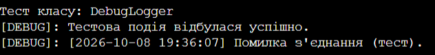

# Лабораторна робота №10. Абстрактні класи та інтерфейси. Контракти та реалізації

Варіант: 2. ISortable та LoggerBase  

Мова програмування: C#  

## Мета роботи

Навчитися створювати та використовувати абстрактні класи та інтерфейси для визначення контрактів та реалізації спільної логіки, а також розуміти критерії вибору між ними.

## Опис роботи

Програма демонструє практичне застосування механізмів ООП (поліморфізму, абстракції та інтерфейсів) на прикладі двох різних підходів:  

* **Інтерфейси:** Реалізовано інтерфейс `ISortable`, який визначає контракт для алгоритмів сортування. Створено дві незалежні реалізації: сортування бульбашкою (`BubbleSort`) та швидке сортування (`QuickSort`).  

* **Абстрактні класи:** Створено базовий абстрактний клас `LoggerBase`, який задає шаблон поведінки для логування подій.  

* **Спільна логіка (конкретні методи):** До абстрактного класу додано готовий метод `LogTimestamp`, який автоматично підставляє поточну дату і час до будь-якого повідомлення перед виводом.  

* **Похідні класи:** Реалізовано класи `ConsoleLogger` та `DebugLogger`, які перевизначають абстрактний метод `WriteLog` для демонстрації різних каналів виводу інформації.  

* **Поліморфний виклик:** У методі `Main` створено колекції типу `List<ISortable>` та `List<LoggerBase>`, що дозволило в єдиному циклі викликати методи для різних об'єктів без знання їхнього конкретного типу.

### Результат виконання програми
 

## Висновок

Під час виконання лабораторної роботи було освоєно практичні навички роботи з інтерфейсами та абстрактними класами, які є ключовими інструментами для побудови гнучких архітектур в ООП.  

Було розібрано архітектурну різницю між ними: інтерфейси використовуються для опису контрактів поведінки (що об'єкт вміє робити, наприклад, сортувати масив), тоді як абстрактні класи дозволяють виділити спільну логіку та часткову реалізацію для тісно пов'язаних сутностей.  

Завдяки використанню поліморфізму вдалося створити код, який працює з абстракціями, а не з конкретними класами. Це забезпечує слабку пов'язаність системи (Loose Coupling) та дозволяє легко розширювати програму, додаючи нові типи логерів чи алгоритми сортування без зміни існуючого коду в `Main`.

## Контрольні запитання

1. У чому полягає основна відмінність між абстрактним класом та інтерфейсом?
* Абстрактний клас задає ідентичність ("є чимось") і може містити як абстрактні методи без реалізації, так і звичайні методи з готовим кодом та поля для збереження стану (змінні).
* Інтерфейс задає поведінку ("вміє щось робити"). До C# 8.0 він міг містити суто оголошення методів чи властивостей без жодного стану (полів) та готової реалізації логіки.

2. Коли доцільно використовувати абстрактний клас, а коли — інтерфейс? Наведіть приклади.
* Абстрактний клас використовують, коли група класів має тісний логічний зв'язок і спільний базовий код (наприклад, у нашому варіанті `LoggerBase` містить спільну логіку форматування часу в методі `LogTimestamp`).
* Інтерфейс використовують, коли поведінку треба додати абсолютно різним класам, які не пов'язані ієрархічно (наприклад, `ISortable` визначає контракт сортування, який можна застосувати до будь-якого алгоритму, класу чи структури даних).

3. Чи може клас успадковувати від кількох абстрактних класів? А реалізовувати кілька інтерфейсів?
* В C# множинне успадкування класів заборонене. Клас може успадкувати лише один абстрактний (або звичайний) клас.
* Проте клас може реалізовувати необмежену кількість інтерфейсів одночасно.

4. Як абстрактні класи та інтерфейси сприяють поліморфізму та гнучкості архітектури?
* Вони дозволяють взаємодіяти з об'єктами через їхні базові типи (`ISortable` або `LoggerBase`), не знаючи конкретної реалізації. Це дозволяє легко додавати нові класи (наприклад, новий вид сортування чи логування), взагалі не змінюючи головний код програми, що робить архітектуру гнучкою до змін.
