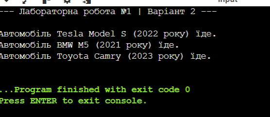

# Лабораторна робота №1. Створення класів та об'єктів
**Варіант:** 2
**Мова програмування:** C#

## Опис роботи
Програма демонструє базові принципи об'єктно-орієнтованого програмування на прикладі створення класу Car (Автомобіль).

## Результат роботи програми

## Висновок
Під час виконання лабораторної роботи було освоєно практичні навички створення класів та об'єктів у мові C#. Реалізовано конструктор для ініціалізації даних та метод для виведення інформації про стан об'єкта. Робота з декількома екземплярами класу підтвердила правильність використання інкапсуляції та незалежність об'єктів один від одного в пам'яті.

## Контрольні запитання

### 1. Що таке клас та об’єкт? Яка між ними різниця?
* **Клас** — це шаблон, креслення або тип даних, який описує, які властивості та методи матимуть створені на його основі сутності. Він не займає місця в пам'яті для даних.
* **Об'єкт** — це конкретний екземпляр класу, створений у пам'яті комп'ютера за цим шаблоном. Він має свої власні конкретні значення властивостей (наприклад, конкретна марка та рік автомобіля).
* **Різниця:** Клас є один (як креслення машини), а об'єктів на його основі можна створити безліч (конкретні фізичні машини).

### 2. Для чого використовуються конструктори? Чи може клас існувати без них?
* **Конструктори** потрібні для автоматичного встановлення початкових значень властивостей об'єкта в момент його створення (виділення пам'яті через оператор `new`).
* **Чи може існувати без них:** Так, клас може існувати без явного написання конструктора. У такому разі компілятор автоматично створить прихований конструктор за замовчуванням, який просто заповнить усі поля нулями або порожніми значеннями.

### 3. Чим відрізняється приватне поле від публічної властивості? Навіщо потрібна інкапсуляція?
* **Приватне поле (private)** — це внутрішня змінна класу, яка схована від зовнішнього світу. До неї не можна звернутися напряму з інших частин програми.
* **Публічна властивість (public property)** — це відкритий "інтерфейс" (методи get та set), який дозволяє безпечно читати або змінювати приватне поле ззовні.
* **Навіщо потрібна інкапсуляція:** Вона захищає внутрішні дані об'єкта від випадкового псування або встановлення некоректних значень (наприклад, встановлення від'ємної швидкості автомобіля). Програма взаємодіє з об'єктом лише через дозволені правила, що робить код безпечним та надійним.
