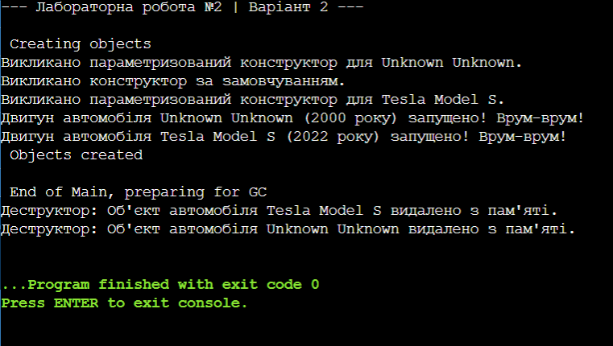

# Лабораторна робота №2. Конструктори та життєвий цикл об'єкта
**Варіант:** 2
**Мова програмування:** C#

## Опис роботи
Програма демонструє роботу з перевантаженими конструкторами, ланцюговим викликом конструкторів через ключове слово `this`, деструкторами та примусовим збором сміття.

### Результат виконання програми

## Висновок
Під час виконання лабораторної роботи було досліджено життєвий цикл об'єктів у мові C#. На практиці реалізовано перевантаження конструкторів та оптимізовано код за допомогою ланцюгового виклику конструкторів. Використання деструктора разом із примусовим викликом збирача сміття (Garbage Collector) дозволило наочно побачити процес знищення об'єктів та звільнення пам'яті.

## Контрольні запитання

### 1. Що таке перевантаження конструкторів? Навіщо воно потрібне?
* **Перевантаження конструкторів** — це створення в одному класі декількох конструкторів, які мають однакову назву (назву класу), але відрізняються списком параметрів (їхньою кількістю або типами даних).
* **Навіщо потрібно:** Воно дозволяє створювати об'єкти класу різними способами залежно від наявних даних. Наприклад, ми можемо створити автомобіль взагалі без параметрів (тоді ввімкнуться значення за замовчуванням) або відразу вказати його марку, модель і рік.

### 2. Як реалізувати ланцюговий виклик конструкторів у C#? Яка від цього користь?
* **Як реалізувати:** Ланцюговий виклик реалізується за допомогою ключового слова `this(...)`, яке пишеться через двокрапку після оголошення конструктора. Це дозволяє одному конструктору викликати інший конструктор того самого класу.
* **Яка користь:** Це усуває дублювання коду. Замість того, щоб у кожному конструкторі заново писати правила присвоєння полей, ми передаємо дані в один головний конструктор, який виконує всю роботу.

### 3. Що таке деструктор (фіналізатор) і коли він викликається? Для чого використовується GC.Collect()?
* **Деструктор** — це спеціальний метод класу (пишеться як `~НазваКласу`), який автоматично викликається системою безпосередньо перед тим, як об'єкт буде остаточно видалено з пам'яті комп'ютера.
* **Коли викликається:** Він викликається збирачем сміття, коли на об'єкт у програмі більше не залишається жодного посилання (об'єкт став непотрібним або програма вийшла з методу, де він був створений).
* **Для чого використовується GC.Collect():** Ця команда примусово запускає роботу збирача сміття (Garbage Collector) прямо зараз. Зазвичай система сама вирішує, коли прибирати пам'ять, але `GC.Collect()` змушує її зробити це негайно, що корисно для тестування або демонстрації знищення об'єктів.
