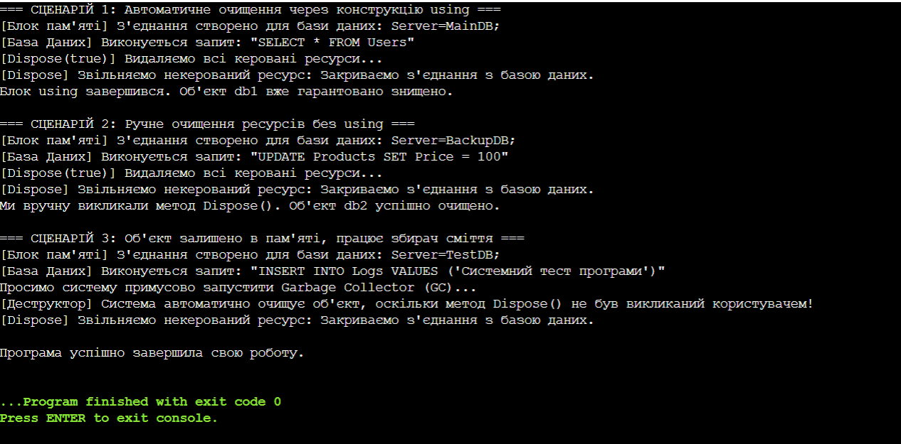

# Лабораторна робота №3. Управління ресурсами та патерн Dispose
**Мова програмування:** C#

## Опис роботи
Програма демонструє керування некерованими ресурсами за допомогою інтерфейсу IDisposable та реалізації патерну Dispose.

## Результат роботи програми

## Висновок
Під час виконання лабораторної роботи було детально вивчено механізми управління ресурсами в платформі .NET. На практиці реалізовано стандартний патерн Dispose для гарантованого звільнення некерованих ресурсів (імітація підключення до бази даних). Досліджено роботу конструкції using для автоматичного контролю життєвого циклу об'єктів та оптимізації взаємодії з пам'яті через відміну фіналізації.

## Контрольні запитання

### 1. Що таке життєвий цикл об’єкта в .NET?
Життєвий цикл об'єкта в .NET — це період від моменту його створення до моменту повного видалення з пам'яті. Він складається з трьох основних етапів:
* **Створення:** виділення пам'яті в керованій купі (heap) за допомогою оператора `new` та виклик конструктора.
* **Використання:** робота програми з об'єктом через посилання на нього.
* **Знищення:** коли на об'єкт не залишається жодного посилання, збирач сміття (Garbage Collector) під час чергового запуску звільняє зайняту ним пам'ять.

### 2. Яка різниця між керованими та некерованими ресурсами?
* **Керовані ресурси (Managed):** це об'єкти, які повністю контролюються середовищем .NET CLR та збирачем сміття (наприклад, звичайні класи, масиви, рядки). Пам'ять з-під них звільняється автоматично.
* **Некеровані ресурси (Unmanaged):** це ресурси операційної системи, про які .NET нічого не знає і не може очистити самостійно. Сюди належать відкриті файли, підключення до баз даних, мережеві сокети, вікна додатків тощо. Їх потрібно закривати вручну.

### 3. Для чого призначений інтерфейс IDisposable?
Інтерфейс `IDisposable` призначений для надання розробнику стандартного механізму ручного звільнення некерованих ресурсів. Він містить лише один метод — `Dispose()`. Якщо клас використовує підключення до файлів чи баз даних, він обов'язково має реалізовувати цей інтерфейс, щоб викликаючий код міг вчасно закрити ці з'єднання, не чекаючи запуску збирача сміття.

### 4. Як оператор using допомагає в керуванні ресурсами?
Оператор `using` автоматизує виклик методу `Dispose()`. Він гарантує, що ресурс буде звільнено відразу після виходу програми за межі блоку `using`. Навіть якщо всередині цього блоку виникне критична помилка (exception), система все одно автоматично викличе метод `Dispose()`, що захищає програму від витоку ресурсів.

### 5. Навіщо в патерні Dispose використовується метод GC.SuppressFinalize()?
Метод `GC.SuppressFinalize(this)` повідомляє збирачу сміття, що об'єкт уже успішно очистив свої ресурси вручну, тому йому більше не потрібно викликати деструктор (фіналізатор). Це суттєво підвищує швидкість роботи програми, оскільки об'єкти з деструкторами живуть у пам'яті довше і потребують додаткових ресурсів для утилізації.

### 6. Чому в деструкторі викликається Dispose(false), а в методі Dispose() - Dispose(true)?
Це основа безпеки патерну Dispose:
* **`Dispose(true)`** викликається користувачем вручну або через `using`. Це означає, що програма працює в штатному режимі, тому можна безпечно очистити і некеровані ресурси (закрити файл), і керовані (обнулити інші пов'язані .NET класи).
* **`Dispose(false)`** викликається автоматично з деструктора, коли користувач забув викликати очищення вручну. У цей момент збирач сміття вже сам знищує інші об'єкти, тому чіпати керовані ресурси небезпечно (вони вже можуть бути видалені). У такому випадку код очищає виключно некеровані ресурси.
