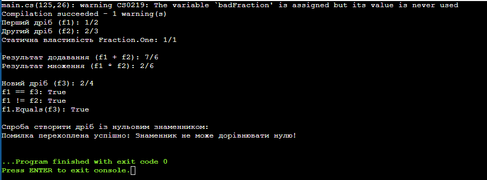

# Лабораторна робота №4. Властивості та статичні члени. Індексатори й перевантаження операторів

Варіант: Клас Fraction (Дріб)  

Мова програмування: C#  

## Мета роботи

Навчитися реалізовувати властивості з перевіркою, використовувати статичні члени класу, а також застосовувати індексатори та перевантажувати оператори для створення більш виразних та зручних класів.

## Опис роботи

Програма демонструє практичне застосування механізмів ООП на прикладі класу `Fraction` (Дріб):  

* **Властивості з валідацією:** Реалізовано безпечний доступ до знаменника з генерацією винятку при спробі встановити нульове значення.  

* **Статичні члени:** Додано статичну властивість `Fraction.One`, яка повертає екземпляр одиничного дробу.  

* **Перевантаження операторів:** Реалізовано арифметичні оператори додавання `+` та множення `*`, а також оператори порівняння `==` та `!=` для інтуїтивної роботи з об'єктами.  

* **Перевизначення методів Object:** Для забезпечення цілісності логіки порівняння перевизначено стандартні методи `Equals`, `GetHashCode` та `ToString`.

### Результат виконання програми
 

## Висновок

Під час виконання лабораторної роботи було освоєно практичні навички створення властивостей із вбудованою логікою валідації для захисту внутрішнього стану об'єкта.  

Було розібрано призначення статичних членів класу, які належать самому типу, а не його екземплярам.  

Перевантаження операторів дозволило підняти рівень абстракції коду, зробивши взаємодію з об'єктами класу `Fraction` наочною та подібною до вбудованих числових типів, що спрощує читання та підтримку програмного забезпечення.

## Контрольні запитання

1. Яка різниця між звичайною властивістю та індексатором?
* Звичайна властивість надає доступ до конкретного поля класу за унікальним іменем (ідентифікатором).
* Індексатор дозволяє звертатися до внутрішніх даних або елементів об'єкта класу так, ніби цей об'єкт є масивом або колекцією, використовуючи квадратні дужки `[]` та передаючи туди індекс або ключ.

2. Навіщо потрібно перевизначати Equals() та GetHashCode() при перевантаженні операторів == та !=?
* Перевизначення цих методів гарантує узгодженість логіки порівняння об'єктів у системі. Якщо два об'єкти рівні через оператор `==`, вони обов'язково повинні повертати `true` через метод `Equals()`.
* Однакові об'єкти повинні мати однакові значення хеш-коду `GetHashCode()`. Якщо цього не зробити, об'єкти класу будуть некоректно працювати у хеш-таблицях та колекціях (наприклад, `HashSet` або `Dictionary`), оскільки вони не зможуть правильно ідентифікувати дублікати.

3. У яких випадках доцільно використовувати статичні члени класу?
* Статичні члени доцільно використовувати для збереження глобального стану або констант, спільних для всіх об'єктів (наприклад, загальні лічильники створених екземплярів, математичні константи як `Math.PI`).
* Також їх використовують для створення допоміжних методів (утиліт), які не залежать від стану конкретного об'єкта (наприклад, `Console.WriteLine()` або фабричні методи для генерації готових об'єктів, як `Fraction.One`).

4. Як інкапсуляція допомагає підтримувати цілісність даних у класі, який ви реалізували?
* Інкапсуляція приховує прямий доступ до приватних полів чисельника та знаменника, змушуючи взаємодіяти з ними виключно через публічні властивості.
* Завдяки цьому блок `set` у властивості знаменника перехоплює будь-які спроби записати туди некоректні дані (наприклад, нуль). Це унеможливлює переведення об'єкта у математично невірний стан, ізолюючи помилку на етапі її виникнення.
Тепер структуру і зміст README повністю адаптовано під ваші вимоги. Чи потрібно внести якісь додаткові зміни у висновок або у вас залишилися запитання по роботі коду?
