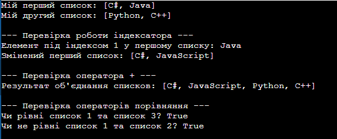

# ЗВІТ
## З лабораторної роботи №5
**Тема:** Індексатори та перевантаження операторів.

**Мета:** Навчитися створювати індексатори та перевантажувати оператори для роботи з класами.

### Хід роботи:
1. Створив(ла) проєкт та реалізував(ла) свій клас з індексатором відповідно до варіанту.
2. Перевантажил(ла) оператори +, ==, != та перевизначив(ла) методи Equals, GetHashCode, ToString.
3. Перевірив(ла) роботу програми у методі Main.

### Результат виконання програми

### Відповіді на запитання:

**3. Які оператори можна перевантажувати в C#?**
Можна перевантажувати арифметичні (+, -, *, /, %), унарні (++, --, !), оператори порівняння (==, !=, <, >, <=, >=) та логічні бінарні. Не можна перевантажувати оператори присвоєння (=, +=), умовні (&&, ||) та тернарний оператор (?:).

**4. Чому при перевантаженні == та != необхідно також перевизначити Equals() та GetHashCode()?**
Щоб порівняння працювало однаково і через оператор ==, і через метод Equals(). А GetHashCode() потрібен для того, щоб однакові об'єкти мали однакові хеш-коди, інакше вони зламають роботу колекцій типу Dictionary або HashSet.

**5. Як індексатори підвищують читабельність коду?**
Вони дозволяють звертатися до об'єкта класу через квадратні дужки як до звичайного масиву. Це робить код значно коротшим і зрозумілішим, бо не треба писати зайві методи доступу.

**Висновок:**
На лабораторній роботі я навчилася створювати індексатори та перевантажувати оператори для зручної роботи з об'єктами класу.
