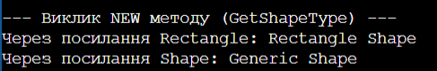

Звіт з лабораторної роботи №6

Тема: Наслідування. Ключові слова base, override, virtual. Приховування членів (new).
Мета: Навчитися створювати ієрархії класів, використовувати ключові слова base, virtual, override для реалізації поліморфізму, а також зрозуміти різницю між override та приховуванням членів за допомогою new.
Хід роботи:
Створив(ла) новий консольний проєкт у директорії згідно з варіантом.
Реалізував(ла) ієрархію класів для другого варіанту: базовий клас Shape (фігура) та похідні класи Circle (коло) і Rectangle (прямокутник).
Додав(ла) конструктори з викликом base, перевизначив(ла) через override віртуальний метод для підрахунку площі та показав(ла) приховування методу через new.
Перевірив(ла) роботу всіх створених класів у методі Main, вивів(ла) результати в консоль для демонстрації поліморфізму та різниці між override і new.

## Результат роботи програми

Відповіді на запитання:
Поясніть принцип наслідування в ООП. Наведіть приклад з реального світу. Це коли один клас (похідний) забирає собі всі поля і методи іншого класу (базового), щоб не писати один і той самий код кілька разів. Наприклад, базовий клас «Транспорт» має швидкість і колір, а похідний клас «Машина» наслідує це і просто додає щось своє, наприклад, тип кузова.
Для чого використовується ключове слово base? Наведіть приклади його застосування. Воно потрібне, щоб звертатися до членів базового класу з похідного. Найчастіше його використовують, щоб викликати конструктор батьківського класу і передати туди початкові дані (як ми передавали колір фігури через : base(color)).
У чому полягає різниця між virtual та override? Як вони забезпечують поліморфізм? Ключове слово virtual ми пишемо в базовому класі біля методу, який дозволяємо змінити далі. А override пишемо вже в похідному класі, коли цей самий метод переписуємо під власну логіку фігури. Разом вони дозволяють програмі під час запуску викликати правильний метод, навіть якщо об'єкт лежить у масиві базового типу.
Коли варто використовувати модифікатор new для приховування члена базового класу, і які наслідки це має? Модифікатор new потрібен, коли в похідному класі треба створити метод з точно таким же ім'ям, як у базовому, але той базовий метод не є віртуальним і його не можна перевизначити через override. Наслідок такий, що метод приховується, а не замінюється: якщо викликати його через посилання базового типу, спрацює старий варіант, а якщо через похідний – новий.

Висновок: На цій лабораторній роботі я навчився(лася) будувати ієрархії класів, розібрався(лася) з наслідуванням, реалізував(ла) поліморфізм через virtual та override, а також перевірив(ла) на практиці, чим приховування методів через new відрізняється від перевизначення.

