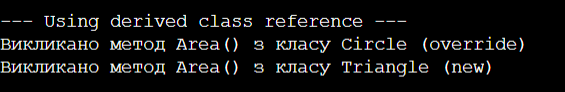

# ЗВІТ
## З лабораторної роботи №7
**Тема:** Приховування методів (new) vs перевизначення (override).

**Мета:** Зрозуміти різницю між приховуванням методів за допомогою ключового слова new та перевизначенням через virtual/override, а також навчитися правильно обирати між цими підходами.

### Хід роботи:
1. Створив(ла) новий консольний проєкт та реалізував(ла) ієрархію класів відповідно до варіанту (базовий клас Shape, похідні Circle та Triangle).
2. Реалізував(ла) у класі Circle перевизначення методу Area() за допомогою override, а в класі Triangle — приховування методу Area() за допомогою new.
3. Перевірив(ла) роботу програми у методі Main, продемонструвавши виклик методів через посилання базового і похідного типів.

### Результат виконання програми

### Відповіді на запитання:

**1. У чому полягає різниця між override та new при роботі з методами?**
Модифікатор `override` повністю замінює метод у пам'яті (забезпечує динамічний зв'язок), тому він викликається залежно від реального типу створеного об'єкта. А модифікатор `new` просто ховає метод базового класу (забезпечує статичний зв'язок), і виклик залежить виключно від типу посилання (змінної).

**2. Що таке поліморфізм і як override його забезпечує?**
Поліморфізм — це можливість об'єктів різних класів виконувати однакові дії по-своєму. `override` забезпечує його за рахунок того, що при виклику методу через базове посилання програма під час роботи сама знаходить і запускає саме перевизначену версію методу конкретного похідного об'єкта.

**3. Чому при використанні new не відбувається динамічного зв'язування?**
Тому що `new` не записує метод у таблицю віртуальних методів базового класу. Компілятор ще на етапі збірки коду жорстко вирішує, який метод викликати, дивлячись тільки на тип змінної-посилання, через яку йде виклик.

**4. Коли доцільно використовувати new замість override?**
Його використовують дуже рідко. Наприклад, коли ми наслідуємося від чужого класу зі сторонньої бібліотеки і нам потрібно створити у своєму класі метод з таким самим ім'ям, але ми не хочемо змінювати логіку базового класу або той метод взагалі не був віртуальним.

**5. Що станеться, якщо забути вказати new при приховуванні методу?**
Програма все одно успішно скомпілюється і буде працювати так, ніби ми написали `new`. Проте компілятор видасть попередження (warning) про те, що ми випадково приховуємо член базового класу, і порадить додати це ключове слово явно для чистоти коду.

**Висновок:**
На лабораторній роботі я навчилася створювати ієрархії класів та на практиці розібралася у різниці між перевизначенням методів через `override` та їх приховуванням через `new`.
