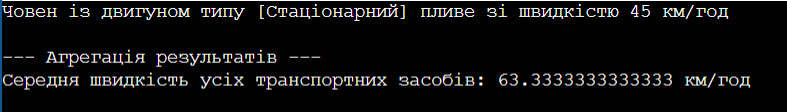

# ЗВІТ
## З лабораторної роботи №8
**Тема:** Поліморфізм: динамічне зв'язування та перевизначення методів.

**Мета:** Навчитися реалізовувати поліморфну поведінку за допомогою віртуальних методів та їх перевизначення, а також агрегувати результати поліморфних викликів.

### Хід роботи:
1. Створив(ла) новий консольний проєкт та реалізував(ла) ієрархію класів відповідно до варіанту (базовий клас Vehicle, похідні Car, Bicycle, Boat).
2. Реалізував(ла) у базовому класі віртуальний метод Move(), а в усіх похідних класах перевизначив(ла) його за допомогою override під конкретну логіку транспорту.
3. Створив(ла) у методі Main колекцію List<Vehicle> об'єктів базового типу, заповнив(ла) її екземплярами всіх похідних класів та викликав(ла) метод Move() в циклі для демонстрації поліморфізму.
4. Реалізував(ла) агрегацію результатів, обчисливши середню швидкість усіх транспортних засобів у колекції.

### Результат виконання програми

### Відповіді на запитання:

**1. Що таке поліморфізм і як він реалізується в C# за допомогою virtual та override?**
Поліморфізм — це здатність об'єктів різних класів реагувати на один і той самий виклик методу по-різному, відповідно до їхнього реального типу. У C# він реалізується так: у базовому класі метод помічається як `virtual` (це дозволяє його змінювати), а в похідних класах пишеться `override`, що повністю переписує логіку цього методу для конкретного підкласу.

**2. Поясніть поняття динамічного зв'язування. Чим воно відрізняється від статичного?**
Динамічне зв'язування (пізнє) означає, що програма визначає, який саме метод викликати, вже безпосередньо під час свого виконання (Runtime), дивлячись на реальний тип об'єкта в пам'яті. Статичне зв'язування (раннє) відбувається ще під час компіляції коду на основі типу змінної-посилання.

**3. Наведіть приклад, як поліморфізм дозволяє писати більш гнучкий та розширюваний код.**
Якщо нам знадобиться додати новий вид транспорту (наприклад, `Plane`), нам достатньо просто створити новий клас, наслідувати його від `Vehicle` та перевизначити метод `Move()`. При цьому основний код у методі `Main` (цикл, робота з колекцією та підрахунок середньої швидкості) взагалі не доведеться міняти чи переписувати.

**4. Які переваги дає використання колекцій базових типів для роботи з поліморфними об'єктами?**
Це дозволяє зберігати абсолютно різні об'єкти (машини, човни, велосипеди) в одному єдиному списку і працювати з ними однаково. Завдяки цьому код стає значно коротшим, зникає потреба створювати окремі масиви під кожен тип об'єкта та писати купу перевірок чи умовних операторів.

**Висновок:**
На лабораторній роботі я навчилася створювати поліморфні класи, працювати з колекціями базових типів та реалізовувати агрегацію даних на основі властивостей об'єктів у списку.
