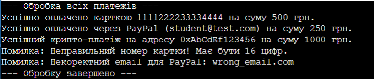

# Лабораторна робота №9. Поліморфні сервіси
**Варіант:** 2
**Мова програмування:** C#

## Опис роботи
Програма показує, як працює поліморфізм через абстрактний клас, як створювати списки з різними об'єктами і як обробляти помилки валідації через try-catch.

### Результат виконання програми

## Висновок
Під час виконання лабораторної роботи я розібралася, як працює поліморфізм у C#. На практиці створила абстрактний клас і перевизначила його методи у трьох різних класах для платежів. Використання окремого сервісу разом із циклом foreach та блоком try-catch дозволило в одному списку обробити всі платежі підряд і красиво вивести помилки, якщо дані були неправильними.

## Контрольні запитання

### 1. Що таке поліморфізм і як він реалізується через спадкування?
* **Поліморфізм** — це коли ми можемо звернутися до різних об'єктів через їхній спільний базовий клас і викликати один і той самий метод, але кожен об'єкт виконає його по-своєму.
* **Як реалізується:** У базовому класі ми пишемо метод з ключовим словом abstract або virtual, а в дочірніх класах переписуємо його логіку через override.

### 2. Яка різниця між абстрактним класом та інтерфейсом?
* **Абстрактний клас** — це недороблений клас, від якого не можна створити об'єкт. Але в ньому можна створювати звичайні змінні (поля) і писати готові методи з кодом. Успадкувати можна тільки один такий клас.
* **Інтерфейс** — це просто список правил (методів без коду), які клас зобов'язаний зробити. В інтерфейсі не можна зберігати змінні, але один клас може реалізувати багато інтерфейсів відразу.

### 3. Чому поліморфізм зручний для роботи зі списками різних типів?
* **Чому зручний:** Тому що ми можемо закинути карту, PayPal і крипту в один загальний список List<Payment>. Нам не треба писати купу перевірок if для кожного типу — ми просто в одному циклі викликаємо метод Process(), і програма сама знає, яку логіку запустити.

### 4. Як обробляти специфічні помилки в поліморфних системах?
* **Як обробляти:** Усередині кожного класу мы робимо звичайну перевірку через if і якщо щось не так — викидаємо помилку через throw new ArgumentException(...). А коли перебираємо список у циклі, ховаємо виклик у блок try-catch, щоб помилка в одному платежі не ламала всю програму.

### 5. Наведіть приклад з реального життя, де застосовується поліморфізм.
* **Приклад:** Кнопки на екрані телефона. Для телефона вони всі однакові — просто кнопки, на які можна клікнути. Але кнопка «Камера» вмикає камеру, а кнопка «Музика» відкриває плеєр. Дія одна (клік), а результат у кожної кнопки свій.
